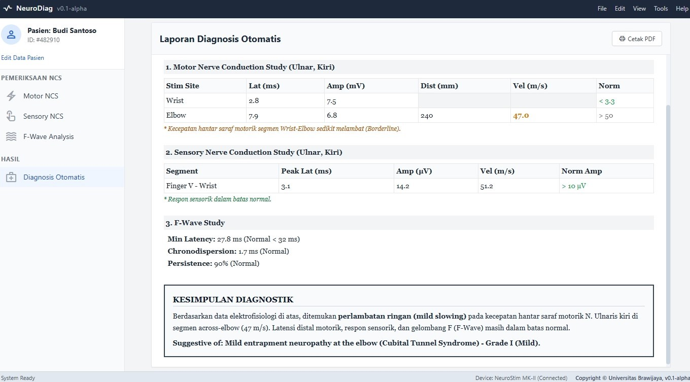
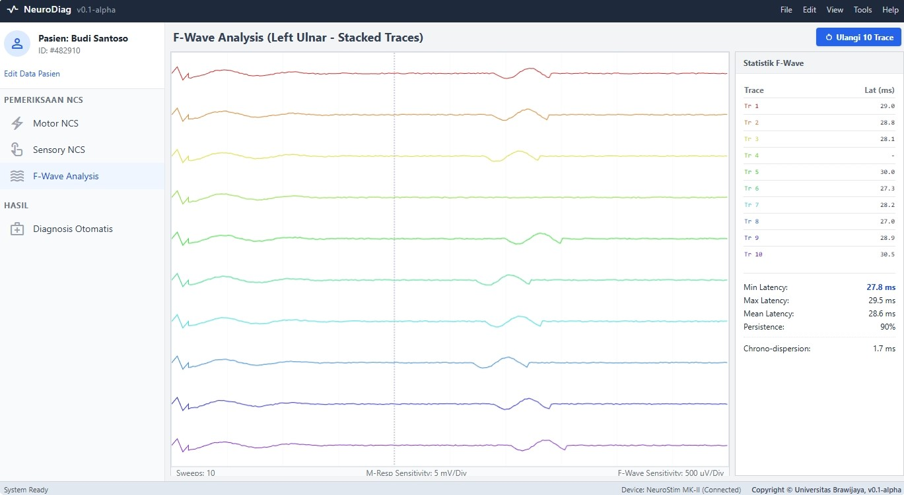
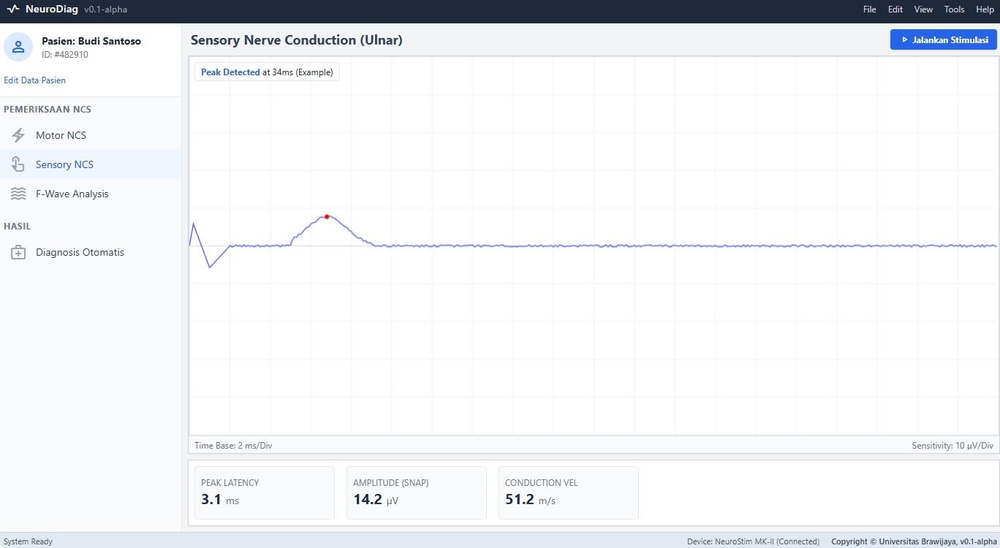
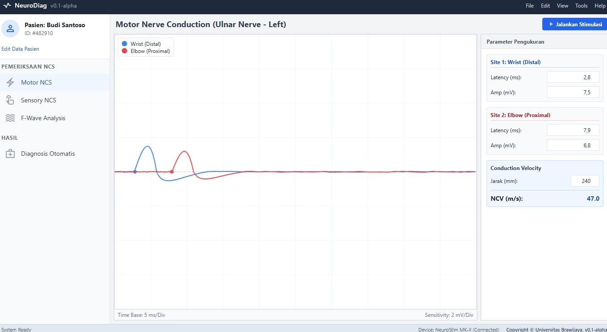

# EMG-MedAI

> 🔬 **Research Project - Under Active Development**

## Overview

EMG-MedAI is a medical AI-powered software for **Electromyography (EMG)** and **Nerve Conduction Study (NCS)** analysis. This application provides automated analysis and diagnostic assistance for neurophysiological signals.

## Features

- 📊 **Signal Analysis Dashboard** - Interactive visualization of EMG/NCS data
- 🤖 **AI-Assisted Diagnostics** - Automated pattern recognition and anomaly detection
- 📈 **Motor NCS Analysis** - Comprehensive nerve conduction study evaluation
- 🌊 **F-Wave Analysis** - Advanced F-wave detection and measurement

## Screenshots

| Dashboard View 1 | Dashboard View 2 |
|------------------|------------------|
|  |  |

| Dashboard View 3 | Dashboard View 4 |
|------------------|------------------|
|  |  |

## System Architecture


## Tech Stack

- **Python** - Core programming language
- **PyQt5** - Desktop GUI framework
- **Plotly** - Interactive data visualization
- **Google Gemini API** - AI-powered diagnostic assistance

## Installation

```bash
# Clone the repository
git clone https://github.com/mmasdar/EMG-MedAI.git

# Navigate to project directory
cd EMG-MedAI

# Install dependencies
pip install -r requirements.txt

# Run the application
python main.py
```

## Status

⚠️ **This project is currently under active research and development.**

## Research Team

**Laboratorium Proteksi Radiasi dan Uji Kesesuaian Pesawat Sinar-X**  
Universitas Brawijaya, Indonesia

**Supervisor:**  
Prof. Chomsin S. Widodo, PhD

### Researchers

| No | Name | NIM | Research Focus |
|----|------|-----|----------------|
| 1 | Anis Sulalah, M.Si | 237090200011005 | Carpal Tunnel Syndrome |
| 2 | Evita Muthi'atul Maula, M.Si | 237090200011003 | Polineuropati |
| 3 | Anifatur Rosyidah Wahyuningsih, S.Si | 256090300111009 | Radikulopati Lumbosakral (Low Back Pain) |
| 4 | Muhammad Masdar Mahasin | 227090200111005 | AI Researcher |

## License & Copyright

© 2026 Laboratorium Proteksi Radiasi dan Uji Kesesuaian Pesawat Sinar-X, Universitas Brawijaya.

This project is protected under copyright law. All rights reserved.  
Unauthorized reproduction, distribution, or use of this software is strictly prohibited without prior written consent from the research team.

---

*Last updated: January 2026*
